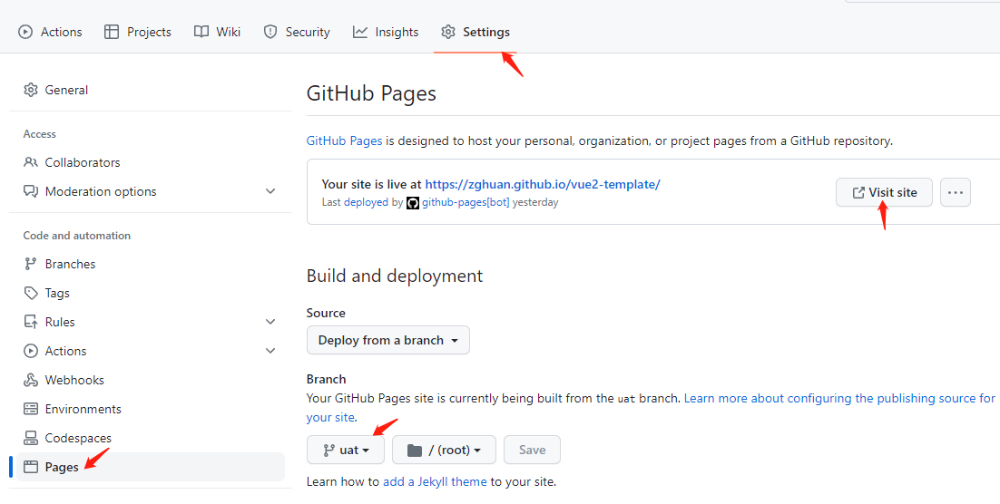
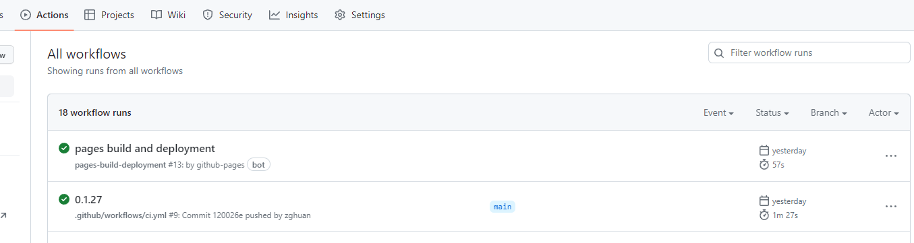

# github-pages 静态站点部署

## 注意事项

### 静态部署不支持服务器配置，所以 `router` 模式要改为 hash ` mode:'hash'`

## 操作步骤

1. 在 github 除了主分支 `mian` 外，额外创建一个空分支如 `uat` 用于存放 github 打包后的文件
2. 根目录增加文件 `.github/workflows/*.yml` 用于激活 `github-pages` 流水线

```
on:
  push:
    branches:
      - main # 这里只配置了main分支，所以只有推送main分支才会触发以下任务
jobs:
  build-and-deploy:
    runs-on: ubuntu-latest
    steps:
      - uses: actions/checkout@v3
      - name: Use Node.js
        uses: actions/setup-node@v3
        with:
          node-version: "14.x"
      - run: node -v
      - run: npm install # 依赖
      - run: npm run pre-build # 预渲染构建命令
      - name: Deploy # 部署
        uses: JamesIves/github-pages-deploy-action@v4.3.3
        with:
          branch: uat # 部署后提交到那个分支，跟步骤1对应
          folder: dist # 这里填打包好的目录名称
```

3. 在 `github` 你的项目里，打开 `setting` -> `pages` -> `Build and deployment`  
   Branch 里的分支改为 `uat` 点击 `Save` 保存

4. 提交代码到 github `main` 主分支 github 服务器变会自动进行打包部署  
   访问地址在你刚配置的 `pages` 页面点击 `Visit site`

  

